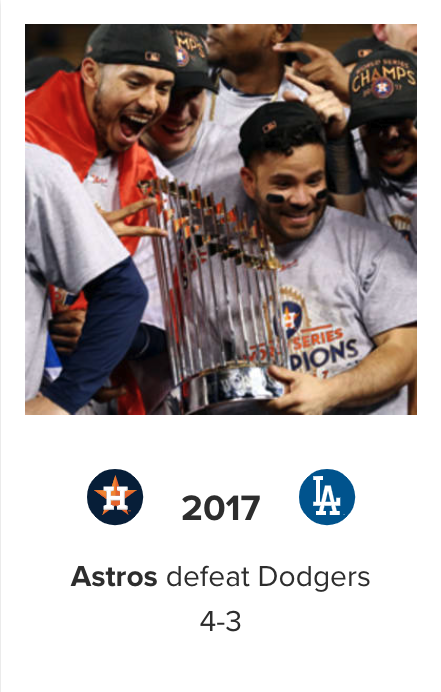

# Benefits of Cheating - a 2017 Baseball Study
### A look at how much, if at all, stealing pitch signs helped the 2017 Astros

### Introduction

The 2017 baseball season was memorable for most everyone who pays attention to baseball. 
For fans of the Houston Astros, like myself, it was an incredible season, which ended with a World Series win. For fans of any other baseball team, the Houston Astros winning the 2017 World Series is almost fully discounted. And the reason for that is the subject of this project: the 2017 Houston Astros Sign Stealing Scandal.
